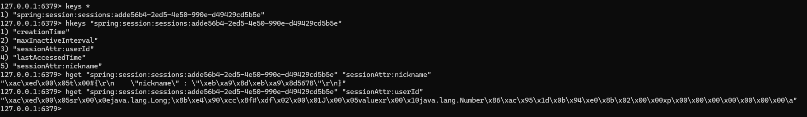

# 일회성 게임의 세션 관리를 위한 방법들 정리해보기

---

* HttpSession
  * 서블릿이 제공하는 HttpSession
  * 서블릿을 통해 HttpSession을 생성하면 다음과 같은 쿠키를 생성한다.
  * `request.getSession(true)`
    * 세션이 있으면 기존 세션을 반환한다.
    * 세션이 없으면 새로운 세션을 생성해서 반환한다.
  * `request.getSession(false)`
    * 세션이 있으면 기존 세션을 반환한다.
    * 세션이 없으면 새로운 세션을 생성하지 않는다.

* @SessionAttribute
  * 스프링 차원에서 제공하는 어노테이션

* Session Storage(Redis) 저장되는 내역 확인
  * HttpSession에서 기본적으로 조회가 가능한 정보
    * creationTime : 
    * lastAccessedTime
    * maxInactiveInterval
  * 개발자가 `setAttribute()` 메서드를 통해 세션에 포함시킨 정보
    * sessionAttr:userId
    * sessionAttr:nickname

▶ 추가 테스트 목록
* 여러 서버를 띄우고 게임에 접속했을 때 세션이 공유가 되는지에 대한 부분 확인하기
* Redis TTL 설정 시 만료 시간이 지난 후에 Redis의 상태 체크하기